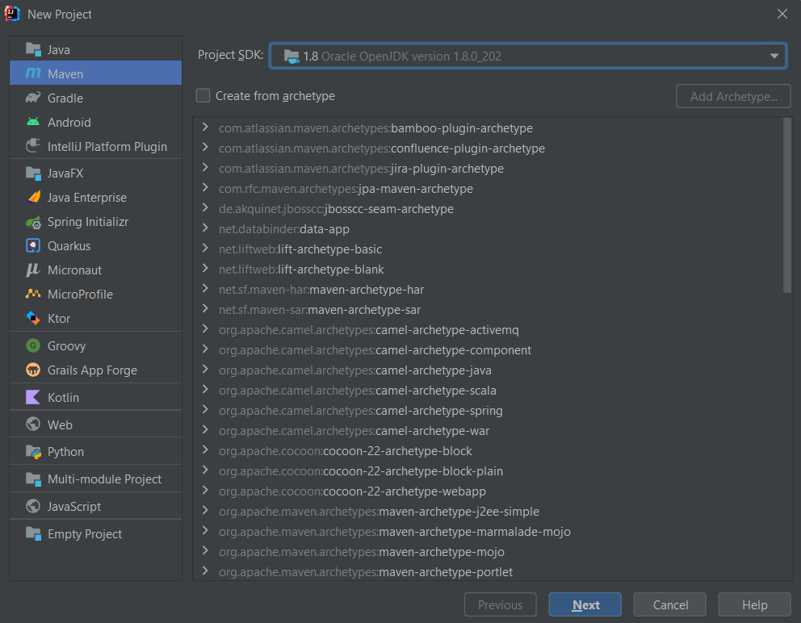
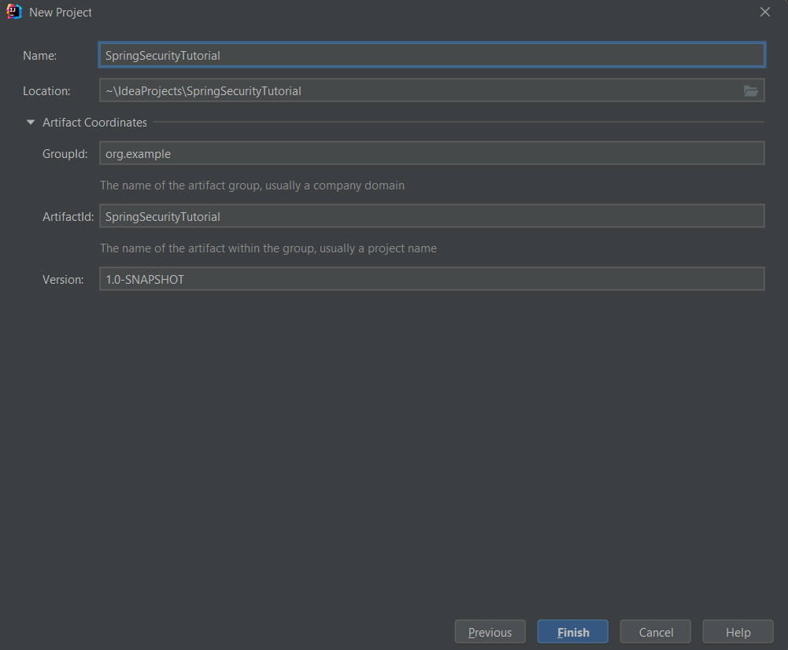

# Spring Security: Пошаговый туториал.

В данной статье мы подробно рассмотрим процесс создания простого веб-приложения с использованием Spring Boot и Spring Security. В рамках этого проекта будет реализована система регистрации новых пользователей, а также механизм авторизации. Основное внимание уделено ограничению доступа к различным страницам сайта в зависимости от роли пользователя.

Цель данной статьи - детально продемонстрировать, как можно эффективно управлять доступом к различным разделам сайта в зависимости от роли конкретного пользователя.

## Концепция приложения 

- страницы доступные всем пользователям: главная, регистрации и логина;
- страница доступная для зарегистрированных пользователей: новости;
- страница доступная для администратора.

## Инструменты и технологии 
- JDK 8+
- Intellij Idea
- Spring (Spring Boot, Spring MVC, Spring Security)
- Hibernate
- JSP
- PostgreSQL

## Оглавление
1. Разъяснение ключевых аннотаций.
2. Как создать новый проект в IDE?
3. Организация структуры проекта (пакетов).
4. Настройка Spring Security.
5. Запуск приложения.

# 1. Разъяснение ключевых аннотаций.

**Controller:**
Контроллер - это специальный класс, применяемый в архитектуре MVC приложений. Похож на стандартный сервлет [HttpServlet](https://docs.oracle.com/cd/E17802_01/webservices/webservices/docs/2.0/api/javax/servlet/http/HttpServlet.html), который взаимодействует с объектами HttpServletRequest и HttpServletResponse, но в контексте Spring Framework обладает расширенными возможностями. Контроллеры отвечают за обработку HTTP-запросов и направление данных между моделью и представлением.

**Repository:**
Аннотация Repository указывает, что класс предназначен для выполнения операций поиска, получения и сохранения данных. Эта аннотация может применяться для реализации паттерна [DAO (Data Access Object)](https://habr.com/ru/articles/262243/), обеспечивая эффективное взаимодействие с базой данных.

**Service:**
Аннотация Service используется для классов, которые выполняют роль сервиса и содержат бизнес-логику. Сервисы обеспечивают выполнение операций, связанных с обработкой данных, в соответствии с бизнес-требованиями.

**Configuration:**
Аннотация Configuration применяется к классам, которые определяют bean-компоненты. Это позволяет Spring контейнеру понять, что класс предоставляет конфигурацию приложения и содержит определения бинов.

**Autowired:**
Аннотация Autowired облегчает инъекцию зависимостей, позволяя Spring автоматически устанавливать значения полей. Это устраняет необходимость вручную управлять передачей экземпляров bean-компонентов между друг другом, делая процесс более простым и удобным.

### Немного информации о Spring Security

Самым фундаментальным объектом является [SecurityContextHolder](https://docs.spring.io/spring-security/site/docs/current/api/org/springframework/security/core/context/SecurityContextHolder.html). В нем хранится информация о текущем контексте безопасности приложения, который включает в себя подробную информацию о пользователе (принципале), работающим с приложением. Spring Security использует объект Authentication, пользователя авторизованной сессии.

«Пользователь» – это просто Object. В большинстве случаев он может быть
приведен к классу **UserDetails**. **UserDetails** можно представить, как адаптер между БД пользователей и тем что требуется Spring Security внутри **SecurityContextHolder**.

Для создания **UserDetails** используется интерфейс **UserDetailsService**, с единственным методом:

```java
UserDetails loadUserByUsername(String username) throws UsernameNotFoundException 
```

# 2. Создание нового проекта в IDE

В данном проекте будет использоваться сборка **Maven**



Под **GroupId** подразумевается уникальный идентификатор компании (или ваше личное доменное имя), которая выпускает проект. **ArtefactId** – это просто название нашего проекта.



После того как наш проект будет создан, необходимо добавить следующие зависимости: 
<details>
  <summary>pom.xml</summary>

```xml
<?xml version="1.0" encoding="UTF-8"?>
<project xmlns="http://maven.apache.org/POM/4.0.0" xmlns:xsi="http://www.w3.org/2001/XMLSchema-instance"
         xsi:schemaLocation="http://maven.apache.org/POM/4.0.0 https://maven.apache.org/xsd/maven-4.0.0.xsd">
    <modelVersion>4.0.0</modelVersion>
    <parent>
        <groupId>org.springframework.boot</groupId>
        <artifactId>spring-boot-starter-parent</artifactId>
        <version>3.2.3</version>
        <relativePath/> <!-- lookup parent from repository -->
    </parent>
    <groupId>com.example</groupId>
    <artifactId>Spring_Secutity_Tutorial</artifactId>
    <version>0.0.1-SNAPSHOT</version>
    <name>Spring Secutity Tutorial</name>
    <description>Spring Secutity Tutorial</description>

    <properties>
        <java.version>1.8</java.version>
    </properties>

    <dependencies>
        <!-- Spring Boot Starter Web: Упрощает создание веб-приложений на основе Spring MVC, включая RESTful приложения, с встроенным сервером (по умолчанию Tomcat). -->
        <dependency>
            <groupId>org.springframework.boot</groupId>
            <artifactId>spring-boot-starter-web</artifactId>
        </dependency>

        <!-- Spring Boot Starter Security: Добавляет функционал Spring Security в приложение для обеспечения аутентификации, авторизации, защиты от XSS, CSRF и др. -->
        <dependency>
            <groupId>org.springframework.boot</groupId>
            <artifactId>spring-boot-starter-security</artifactId>
        </dependency>

        <!-- Spring Boot Starter Data JPA: Упрощает работу с базами данных через JPA, поддерживает Hibernate. -->
        <dependency>
            <groupId>org.springframework.boot</groupId>
            <artifactId>spring-boot-starter-data-jpa</artifactId>
        </dependency>

        <!-- PostgreSQL JDBC Driver: Драйвер для подключения к базам данных PostgreSQL. -->
        <dependency>
            <groupId>org.postgresql</groupId>
            <artifactId>postgresql</artifactId>
            <scope>runtime</scope>
        </dependency>

        <!-- JSTL: JavaServer Pages Standard Tag Library, предоставляет стандартные теги для JSP. -->
        <dependency>
            <groupId>javax.servlet</groupId>
            <artifactId>jstl</artifactId>
            <version>1.2</version>
        </dependency>

        <!-- Tomcat Embed Jasper: Позволяет обрабатывать JSP страницы во встроенном сервере Tomcat. -->
        <dependency>
            <groupId>org.apache.tomcat.embed</groupId>
            <artifactId>tomcat-embed-jasper</artifactId>
            <version>9.0.27</version>
        </dependency>

        <!-- Spring Security Taglibs: Предоставляет теги для JSP, интегрирующиеся с Spring Security. -->
        <dependency>
            <groupId>org.springframework.security</groupId>
            <artifactId>spring-security-taglibs</artifactId>
            <version>5.2.0.RELEASE</version>
        </dependency>

        <!-- Spring Boot Devtools: Инструменты для разработчиков, включая автоматическую перезагрузку приложения при изменениях кода. -->
        <dependency>
            <groupId>org.springframework.boot</groupId>
            <artifactId>spring-boot-devtools</artifactId>
        </dependency>
    </dependencies>
    
    <build>
        <plugins>
            <plugin>
                <groupId>org.springframework.boot</groupId>
                <artifactId>spring-boot-maven-plugin</artifactId>
            </plugin>
        </plugins>
    </build>
</project>

```
</details>

# 3. Организация структуры проекта (пакетов).

```adruino
main
├── java
│   └── com.example.spring_security_tutorial
│       ├── config
│       │   ├── MvcConfig.java
│       │   └── WebSecurityConfig.java
│       ├── controller
│       │   ├── AdminController.java
│       │   └── RegistrationController.java
│       ├── entity
│       │   ├── Role.java
│       │   └── User.java
│       ├── repository
│       │   ├── RoleRepository.java
│       │   └── UserRepository.java
│       ├── service
│       │   ├── SecurityService.java
│       │   └── UserService.java
│       └── SpringSecurityTutorialApplication.java
├── resources
│   ├── application.properties
└── webapp
    ├── resources
    │   ├── css
    │   └── js
    └── WEB-INF
        └── jsp
            ├── admin.jsp
            ├── index.jsp
            ├── login.jsp
            ├── news.jsp
            └── registration.jsp
```

- **config** — классы с конфигурациями для **MVC (MvcConfig)** и безопасности (**WebSecurityConfig**);
- **controller** — классы с контроллерами, которые будут отвечать за обработку входящих HTTP запросов;
- **entity** — классы с моделями;
- **repository** — Пакет для интерфейсов репозиториев, которые используют **Spring Data JPA** для обеспечения абстракции над слоем доступа к данным.;
- **service** — Пакет содержит сервисы, которые содержат бизнес-логику приложения и вызывают методы из репозиториев для доступа к данным.;
- **webapp\resources** — статические объекты: js, css, img;
- **WEB-INF\jsp** — представления в виде файлов .jsp.

Теперь, когда структура проекта создана, нужно заполнить файл **application.properties**

Первые 3 строки содержат данные для подключения к БД (имя БД – «spring», логин и пароль). Последний 2 строки указывают путь к .jsp файлам:

```
spring.datasource.url=jdbc:postgresql://localhost/spring
spring.datasource.username=postgres
spring.datasource.password=password
spring.jpa.show-sql=true
spring.jpa.generate-ddl=false
spring.jpa.hibernate.ddl-auto=update
spring.jpa.properties.hibernate.jdbc.lob.non_contextual_creation=true

spring.mvc.view.prefix = /WEB-INF/jsp/
spring.mvc.view.suffix = .jsp
```

Свойство `spring.jpa.show-sql` позволяет выводить в консоль SQL-запросы, отправляемые к базе данных. Когда `spring.jpa.hibernate.ddl-auto` установлено в значение `update`, это означает, что таблицы и их поля в базе данных будут созданы или обновлены автоматически на основе сущностей (entity), определенных в приложении. Таким образом, нам нужно лишь создать базу данных с именем "spring", а остальные таблицы (пользователи, роли и связующая таблица) с их внешними ключами будут сформированы автоматически по схеме, определенной в сущностях.

# 4. Настройка Spring Security.

Для того что бы начать работу со **Spring Security** необходимо добавить
следующую зависимость в `pom.xml` :
```xml
<dependency>
    <groupId>org.springframework.boot</groupId>
    <artifactId>spring-boot-starter-security</artifactId>
</dependency>
```

Сразу же после добавления этой зависимости, в приложении автоматически будет настроена
базовая конфигурация **Spring Security**. Она включает в себя основные механизмы аутентификации и авторизации.
Так же будут предоставлены точки входа и выхода из системы - `/login` для входа и `/logout` для выхода из системы.

Прелесть в том, что **Spring Security** хорошо интегрируется
с другими аспектами **Spring Boot**, такими как **Spring MVC**, 
**Spring Data** и другими. Это обеспечивает высокую гибкость 
настройки приложения.

### Рассмотрим на примере 
`WebSecurityConfig` - данный класс настраивает безопасность
веб-приложения. 
Он определяет правила аутентификации и авторизации, 
настраивает точки входа и выхода из системы, 
а также управляет доступом к различным URL и ресурсам приложения.
```java
@Configuration
@EnableWebSecurity
public class WebSecurityConfig extends WebSecurityConfigurerAdapter {
    
    @Autowired
    UserService userService;
    
    @Override
    protected void configure(HttpSecurity httpSecurity) throws Exception {
        httpSecurity
                .csrf()
                .disable()
                .authorizeRequests()
                //Доступ только для не зарегистрированных пользователей
                .antMatchers("/registration").not().fullyAuthenticated()
                //Доступ только для пользователей с ролью Администратор
                .antMatchers("/admin/**").hasRole("ADMIN")
                .antMatchers("/news").hasRole("USER")
                //Доступ разрешен всем пользователей
                .antMatchers("/", "/resources/**").permitAll()
                //Все остальные страницы требуют аутентификации
                .anyRequest().authenticated()
                .and()
                //Настройка для входа в систему
                .formLogin()
                .loginPage("/login")
                //Перенарпавление на главную страницу после успешного входа
                .defaultSuccessUrl("/")
                .permitAll()
                .and()
                .logout()
                .permitAll()
                .logoutSuccessUrl("/");
    }

    @Bean
    public BCryptPasswordEncoder bCryptPasswordEncoder() {
        return new BCryptPasswordEncoder();
    }
    
    @Autowired
    protected void configureGlobal(AuthenticationManagerBuilder auth) throws Exception {
        auth.userDetailsService(userService).passwordEncoder(bCryptPasswordEncoder());
    }
}
```
### Аутентификация:
Метод `configureGlobal(AuthenticationManagerBuilder auth)` 
предоставляет настройку аутентификации, 
которая реализуется с помощью объекта **AuthenticationManagerBuilder**.
Именно с помощью методов этого объекта и обрабатывается процесс аутентификации.
В нашем случае в каче

`auth.userDetailsService(userService) `:
Этот вызов устанавливает сервис пользователей (**userService**) 
в качестве источника пользовательских данных для аутентификации. 
Сервис пользователей должен реализовывать интерфейс **UserDetailsService**, 
который обеспечивает метод загрузки пользовательских 
данных по имени пользователя.
```java
@Service
public class UserService implements UserDetailsService {
    
    // остальной код...
    
    @Override
    public UserDetails loadUserByUsername(String username) throws UsernameNotFoundException {
        User user = userRepository.findByUsername(username);

        if (user == null) {
            throw new UsernameNotFoundException("User not found");
        }

        return user;
    }
    
}
```

Метод `loadUserByUsername(String username)` сервиса пользователей (**UserService**) 
использует репозиторий **JPA (UserRepository)** для выполнения запроса
к базе данных и получения информации о пользователе.

**UserDetails** представляет информацию о пользователе, 
которая может быть сохранена и извлечена из базы данных с использованием **JPA**.

**AuthenticationManagerBuilder** позволяет настроить механизм аутентификации 
**Spring Security**, который использует информацию о пользователях,
полученную из базы данных через **JPA**, для проверки подлинности пользователей.


`.passwordEncoder(bCryptPasswordEncoder())`: 
Этот вызов устанавливает объект **BCryptPasswordEncoder** 
в качестве метода кодирования паролей. Пароли пользователей будут 
хешироваться с использованием алгоритма **BCrypt** перед сохранением или 
сравнением.

### Конфигурация доступа:

Класс `WebSecurityConfig` наследуется от класса `WebSecurityConfigurerAdapter`, основой которого,
является метод `configure(HttpSecurity http)`. Этот метод принимает объект `HttpSecurity`,
представляющий конфигурацию доступа к различным URL приложения и многое другое. Делается это с помощью
цепочек методов объекта `HttpSecurity`. В качестве параметров метода `antMatchers()` 
передаем пути, для которых хотим установить ограничение. 
Затем указываем, пользователям с какой ролью будет доступна 
эта страница/страницы.


[//]: # (Вы можете найти полный код проекта в моем репозитории на [GitHub]&#40;https://github.com/lesswixx/SpringSecutityTutorial&#41;.)


